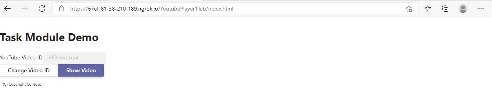
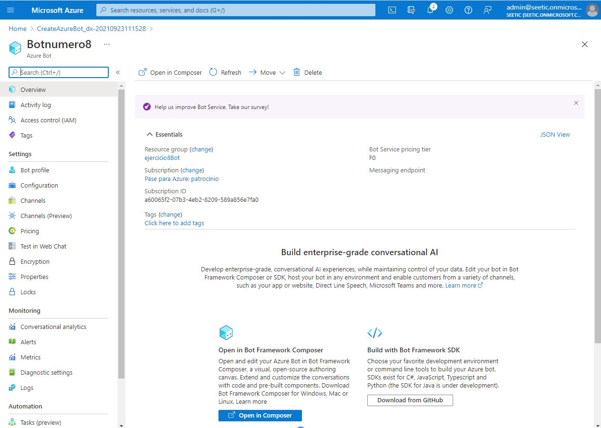
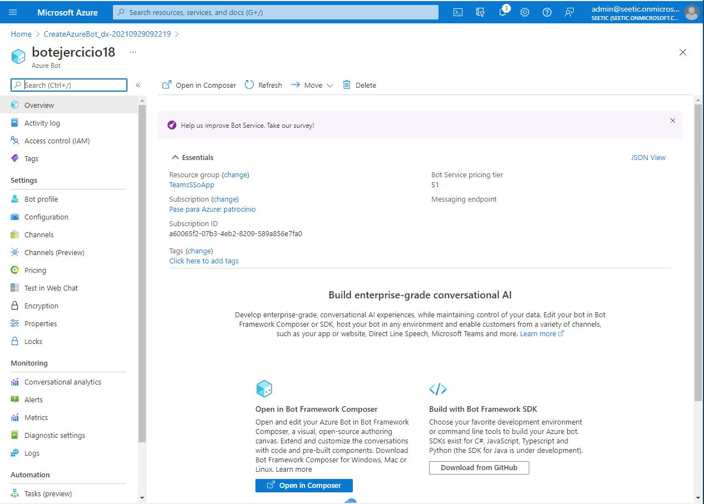

# EVIDENCIAS MS 600 - LAB 04

## EJERCICIO 1

## EJERCICIO 2

## 

## EJERCICIO 3

# EJERCICIO 4

# EJERCICIO 5

# EJERCICIO 6

# EJERCICIO 7

# EJERCICIO 8

# EJERCICIO 9

# EJERCICIO 10

# EJERCICIO 11

# EJERCICIO 12

# EJERCICIO 13 (NO)

# EJERCICIO 14 (NO)

# EJERCICIO 15 (NO)

# EJERCICIO 16

# EJERCICIO 17

# EJERCICIO 18

